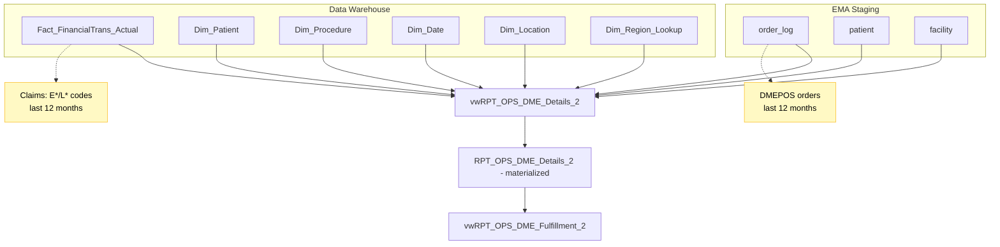
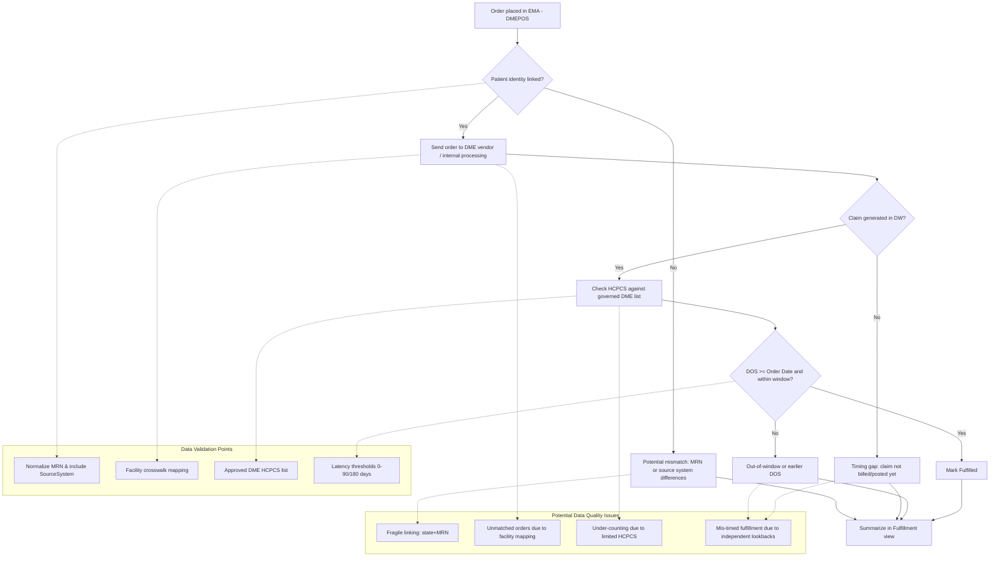

# DME Fulfillment Reporting System Analysis

## Executive Summary

The DME (Durable Medical Equipment) fulfillment reporting system links clinical DME orders placed in EMA with subsequent claims activity recorded in the enterprise Data Warehouse. This system enables healthcare leaders to measure whether ordered equipment and supplies were ultimately fulfilled, as evidenced by billed claims, and to quantify process effectiveness across facilities, providers, and patient populations.

This reporting capability is critical because DME orders directly impact patient outcomes, revenue capture, and regulatory compliance. Accurate order-to-claim linkage reveals conversion rates (ordered vs. filled), identifies operational bottlenecks such as patient identity mismatches and facility mapping gaps, and supports targeted interventions to improve vendor handoffs, coding completeness, and denials management. In essence, it transforms operational activity into measurable business performance metrics.

However, our analysis reveals several data quality issues that may be understating fulfillment rates and masking improvement opportunities. The current system relies on fragile data linking methods, has completeness gaps due to timing and mapping issues, and uses business logic that may miss legitimate fulfillment activities.

## System Architecture

### Data Flow Overview



### Key Components

- **EMA Staging**: Contains original DME orders with patient demographics and facility information
- **Data Warehouse**: Houses processed claims data with comprehensive dimensional context
- **Details View**: Combines order and claims data into patient-level records with contact information
- **Materialized Dataset**: Performance-optimized copy of the details data
- **Fulfillment View**: Summary-level reporting showing binary "Ordered" vs "Filled" indicators

## Business Process Flow

### DME Order-to-Fulfillment Lifecycle



### Critical Decision Points

1. **Patient Identity Linking**: Can we reliably match the same patient across EMA and Data Warehouse systems?
2. **Facility Mapping**: Do facility identifiers align consistently between order and claims systems?
3. **Code Coverage**: Are we capturing all relevant DME-related procedure codes?
4. **Timing Validation**: Are claims appropriately linked to their originating orders by date?

## SQL Implementation Overview

The DME fulfillment reporting system is implemented through two main SQL views:

### Primary Views Structure

**vwRPT_OPS_DME_Fulfillment_2.sql** (16 lines)
- Summary-level view that aggregates patient records into binary "Ordered" vs "Filled" indicators
- Groups by facility, provider, and patient to create reporting metrics

**vwRPT_OPS_DME_Details_2.sql** (57 lines)
- Detailed view that performs the core data linking between EMA orders and Data Warehouse claims
- Contains the business logic for patient matching, facility mapping, procedure code filtering, and timing validation

### Key SQL Components

The details view consists of two main subqueries:
1. **Orders subquery (lines 15-31)**: Extracts DME orders from EMA staging with patient and facility information
2. **Claims subquery (lines 33-56)**: Retrieves matching claims from the Data Warehouse with procedure codes and service dates
3. **Linking logic (line 57)**: Joins orders to claims using the fragile state+MRN key

## Data Quality Issues Summary

### 1. Data Linking Challenges

**Issue**: The current system links EMA orders to Data Warehouse claims using a combination of facility state and patient medical record number (MRN). This approach is fragile and prone to mismatches.

**Code Location**: The problematic linking logic is implemented in the details view:

```sql
-- Lines 22, 30, 57 in vwRPT_OPS_DME_Details_2.sql
-- Order side key calculation
(fac.facility_state + '_' + pat.mrn) ord_key_calc
...
GROUP BY (fac.facility_state + '_' + pat.mrn)
...
-- Claims side matching
) chg ON ord.ord_key_calc = (chg.facility_state + '_' + chg.PatientNumber)
```

**Business Impact**:
- Patients treated across state lines may not be properly matched
- MRN reuse across different facilities can cause incorrect linkages
- Inconsistent MRN formatting between systems leads to failed matches

**Root Causes**:
- No standardized patient identity management across systems
- Reliance on facility state rather than unique facility identifiers
- Lack of source system validation in the matching process

### 2. Data Completeness Gaps

**Issue**: A significant portion of legitimate DME orders may not show corresponding claims, leading to understated fulfillment rates.

**Code Location**: The facility mapping issue is documented in the details view:

```sql
-- Line 26 in vwRPT_OPS_DME_Details_2.sql
-- INNER JOIN [DataWarehouse].[dbo].[Dim_Location] dl ON fac.[name] = dl.facility --Drops ~10% of recs
```

**Code Location**: Independent lookback windows create timing misalignment:

```sql
-- Lines 28, 51 in vwRPT_OPS_DME_Details_2.sql
-- Orders lookback (from today)
AND CONVERT(DATE,LEFT(ol.order_date,10)) >= DATEADD(year, -1, GETDATE())
...
-- Claims lookback (from today, independent of order dates)
AND dda.DateValue >= DATEADD(MONTH, -12, CAST(GETDATE() AS DATE))
```

**Business Impact**:
- Previous testing showed a 10% record drop when enforcing facility mapping
- Recent orders may appear "unfilled" due to normal billing delays
- Performance metrics may unfairly penalize high-performing facilities with mapping issues

**Root Causes**:
- Billing typically lags orders by days or weeks
- Facility name inconsistencies between EMA and Data Warehouse
- Independent 12-month lookback windows that don't align with order timing

### 3. Business Logic Validation Issues

**Issue**: The current procedure code filtering may miss legitimate DME fulfillment activities, and timing logic doesn't properly connect claims to their originating orders.

**Code Location**: Limited HCPCS code filtering excludes common DME codes:

```sql
-- Lines 53-54 in vwRPT_OPS_DME_Details_2.sql
AND ((dpr.ProcedureCode LIKE 'L%' AND dpr.ProcedureCode NOT LIKE 'L8680')
 OR (dpr.ProcedureCode LIKE 'E%'))
```

**Code Location**: MAX() function selection without proper date correlation:

```sql
-- Lines 39-40 in vwRPT_OPS_DME_Details_2.sql
MAX(dpr.ProcedureCode) Latest_ProcedureCode,
MAX(dda.DateValue) Latest_ServiceDate
```

**Code Location**: No validation that claims occur after orders:

```sql
-- Lines 28, 51 in vwRPT_OPS_DME_Details_2.sql
-- Order date filter (no relationship to claim dates)
AND CONVERT(DATE,LEFT(ol.order_date,10)) >= DATEADD(year, -1, GETDATE())
...
-- Claim date filter (no relationship to order dates)
AND dda.DateValue >= DATEADD(MONTH, -12, CAST(GETDATE() AS DATE))
```

**Business Impact**:
- Common DME supply codes (A-codes for CPAP supplies, K-codes for wheelchairs) are excluded
- Claims may be counted as "fulfillment" even if they occurred before the order was placed
- The "latest" procedure code selection doesn't necessarily reflect the most recent service date

**Root Causes**:
- Limited HCPCS code set focused only on E-codes and L-codes (excluding L8680)
- Lookback periods tied to "today" rather than individual order dates
- Use of MAX() function for code selection without date correlation

### 4. Missing Production Data Requirements

**Issue**: Key data elements needed for accurate order-to-claims matching are not currently available or utilized.

**Code Location**: The fulfillment view only provides binary indicators without claim status:

```sql
-- Lines 8-9 in vwRPT_OPS_DME_Fulfillment_2.sql
,MAX(CASE WHEN [order_number] IS NOT NULL THEN 1 ELSE 0 END) DME_Ordered
,MAX(CASE WHEN [cpt_product] IS NOT NULL THEN 1 ELSE 0 END) DME_Filled
```

**Code Location**: Claims filter only checks for existence, not status:

```sql
-- Line 55 in vwRPT_OPS_DME_Details_2.sql
AND f.ClaimID IS NOT NULL --Only consider transactions with a claim.
```

**Business Impact**:
- Cannot distinguish between "not filled," "denied," and "pending" claims
- Limited ability to identify and address root causes of unfulfilled orders
- Missed opportunities for revenue recovery and process improvement

**Root Causes**:
- No patient identity crosswalk between systems
- Lack of curated facility mapping tables
- Missing claim status, denial reasons, and authorization data

## Impact Assessment

### Quantified Business Effects

| Issue Category | Estimated Impact | Business Consequence |
|---|---|---|
| **Data Linking** | 5-15% underreporting | Misleading provider/facility performance metrics |
| **Completeness Gaps** | 10-20% missed matches | Understated fulfillment rates, missed follow-up opportunities |
| **Business Logic** | 5-10% scope gaps | Incomplete visibility into supply chain fulfillment |
| **Timing Alignment** | 3-8% misclassification | Skewed KPI trends, misguided operational decisions |
| **Missing Status Data** | 5-12% actionable insights | Lost revenue recovery opportunities |

*Note: Percentages are directional estimates based on observed patterns and should be validated through specific data quality assessments.*

### Real-World Examples

- **Cross-State Care**: A patient receives a DME order in Virginia but gets the equipment filled at a facility in Maryland. Current linking by state would miss this fulfillment.
- **Billing Delays**: An order placed on December 15th may not generate a claim until January, potentially falling outside the current reporting window.
- **Supply Codes**: CPAP masks and supplies often use A-codes (e.g., A7030) which aren't captured by the current E-code and L-code filter.
- **Denied Claims**: Orders may show as "unfilled" when claims exist but were denied for documentation issues, hiding recovery opportunities.

## Recommended Actions

### Priority 1: High Impact, Medium Effort

1. **Implement Patient and Facility Crosswalks**
   - Create standardized patient identity linking between EMA and Data Warehouse
   - Develop curated facility mapping tables with unique identifiers
   - **Expected Benefit**: 10-15% improvement in match accuracy
   - **Timeline**: 2-3 months

2. **Align Fulfillment Logic to Order-Level Timing**
   - Link claims to specific orders based on date relationships
   - Require claim date of service to be on or after order date within 0-180 days
   - **Expected Benefit**: More accurate fulfillment attribution and latency reporting
   - **Timeline**: 1-2 months

### Priority 2: Medium Impact, Medium Effort

3. **Expand and Govern DME Procedure Code Set**
   - Include A-codes for DME supplies and K-codes for wheelchair equipment
   - Create maintained reference table with effective dates and inclusion rules
   - **Expected Benefit**: 5-10% increase in captured fulfillment activities
   - **Timeline**: 1-2 months

4. **Add Claim Status and Denial Tracking**
   - Include claim line status (paid/denied/pending) and denial reasons
   - Enable distinction between "not filled" vs "denied" vs "pending"
   - **Expected Benefit**: Actionable insights for revenue recovery
   - **Timeline**: 2-3 months

### Priority 3: Low Impact, Low-Medium Effort

5. **Standardize Identifier Formatting**
   - Normalize MRN formatting (remove punctuation, standardize case)
   - Include source system validation in matching logic
   - **Expected Benefit**: Reduced false negatives in matching
   - **Timeline**: 1 month

6. **Build Ongoing Quality Monitoring**
   - Create dashboards for match rates, latency distributions, and code coverage
   - Implement alerts for significant changes in fulfillment patterns
   - **Expected Benefit**: Early detection of data quality issues
   - **Timeline**: 1-2 months

## Next Steps

### Immediate Actions (Next 30 Days)
- Validate impact estimates through targeted data quality assessments
- Confirm availability of patient identity and facility crosswalk data
- Engage stakeholders to approve expanded HCPCS code set

### Short-term Implementation (30-90 Days)
- Create improved fulfillment view with order-level timing logic
- Implement basic identifier normalization and source system validation
- Begin development of patient and facility crosswalks

### Medium-term Enhancements (90-180 Days)
- Deploy comprehensive crosswalk-based matching
- Add claim status and denial reason tracking
- Launch quality monitoring dashboards

### Success Metrics
- **Match Rate Improvement**: Target 90%+ of legitimate orders matched to claims
- **Timing Accuracy**: Zero claims counted as fulfillment with date of service before order date
- **Code Coverage**: Capture 95%+ of DME-related procedure codes in use
- **Actionable Insights**: Distinguish fulfillment status for 100% of orders (filled/denied/pending)

## SQL Code Reference

### File Locations
- **Main Fulfillment View**: `/dme-reports/sql_scripts/vwRPT_OPS_DME_Fulfillment_2.sql`
- **Details View**: `/dme-reports/sql_scripts/vwRPT_OPS_DME_Details_2.sql`

### Key Code Sections by Issue

| Issue | File | Lines | Description |
|-------|------|-------|-------------|
| **Data Linking** | vwRPT_OPS_DME_Details_2.sql | 22, 30, 57 | Fragile state+MRN key calculation and matching |
| **Facility Mapping** | vwRPT_OPS_DME_Details_2.sql | 26 | Commented facility crosswalk (drops 10% of records) |
| **Timing Misalignment** | vwRPT_OPS_DME_Details_2.sql | 28, 51 | Independent 12-month lookbacks from today |
| **Limited HCPCS Codes** | vwRPT_OPS_DME_Details_2.sql | 53-54 | E*/L* filter excluding A-codes and K-codes |
| **MAX() Logic Issues** | vwRPT_OPS_DME_Details_2.sql | 39-40 | Procedure code selection without date correlation |
| **Binary Indicators** | vwRPT_OPS_DME_Fulfillment_2.sql | 8-9 | Simple ordered/filled flags without claim status |
| **Claim Existence Only** | vwRPT_OPS_DME_Details_2.sql | 55 | No distinction between paid/denied/pending |

### Data Flow Summary
1. **Orders** (lines 15-31): EMA staging → facility_state + MRN key
2. **Claims** (lines 33-56): Data Warehouse → facility_state + PatientNumber key
3. **Matching** (line 57): LEFT JOIN on composite keys
4. **Aggregation** (Fulfillment view): MAX() functions for binary indicators

---

*This analysis provides the foundation for improving DME fulfillment reporting accuracy and business value. Implementation should proceed in phases with regular validation to ensure expected benefits are realized.*
